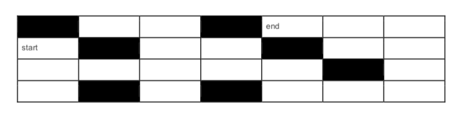

# Labyrinth Solution Provider APIs with NodeJS, ExpressJS, and MangoDB.



## Try My Docker Image
```
docker run -p 3000:3000 -d syedshahidashiqali/ionos-api-server

```
## Endpoints

### REST APIs provide the following endpoints:

#### Return all the labyrinths for the current user:

Structure:

```
GET /labyrinth
```

#### Return a specific labyrinth of the user by ID:

Structure:

```
GET /labyrinth/:id
```

#### Create an empty labyrinth and return the labyrinth ID:

Structure:

```
POST /labyrinth
```

#### Set the type of the specific block of the labyrinth using x/y coordinates (type is either 'empty' or 'filled'):

Structure:

```
PUT /labyrinth/:id/playfield/:x/:y/:type
```

#### set the starting block of the labyrinth using x/y coordinates:

Structure:

```
PUT /labyrinth/:id/start/:x/:y
```

#### Set the ending block of the labyrinth using x/y coordinates:

Structure:

```
PUT /labyrinth/:id/end/:x/:y
```

#### Return a solution for the labyrinth:

Structure:

```
GET /labyrinth/:id/solution
```

##### Solution is the array of directions in the following format:

```
['left', 'up', 'right', 'down', 'down', 'down']
```
